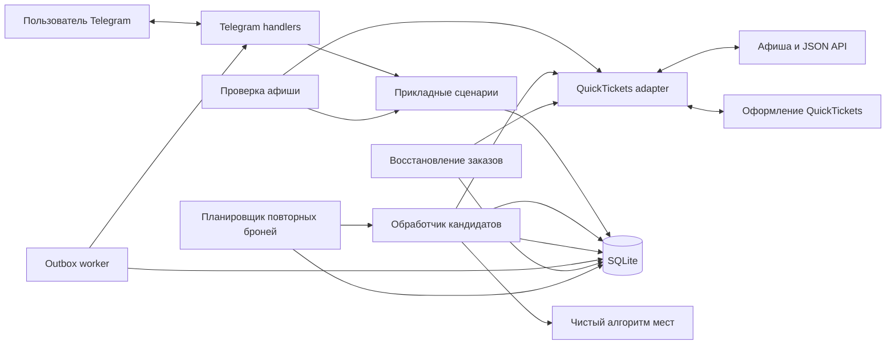
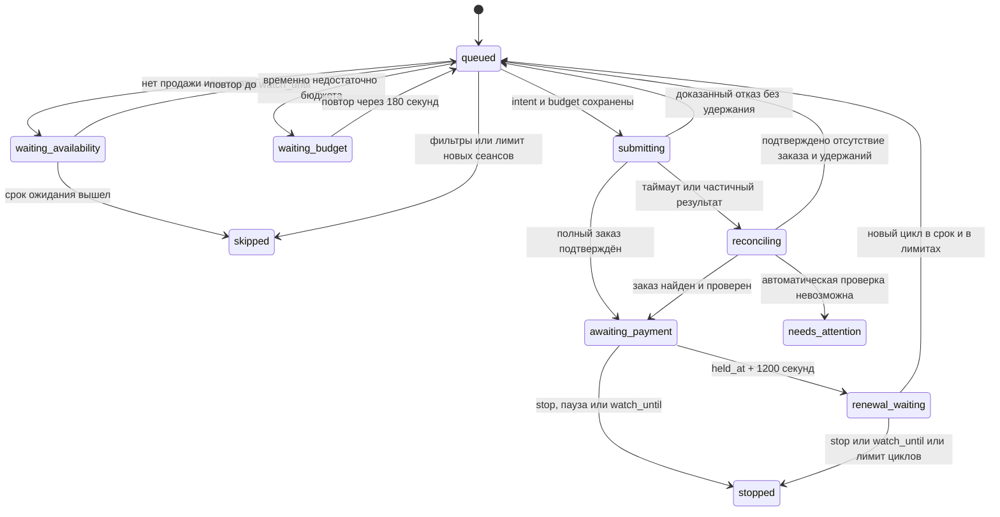

# Архитектура

Дополнение от 26.09.2026: [70 отдельных билетов](organization-booking.md).
В режиме `individual_orders` discovery создаёт до 70 Candidate на покупателя/сеанс
с уникальными `ticket_no`; каждый имеет собственные циклы, intent и outbox.
`target_seat_id` закрепляется атомарно перед POST и сохраняется после успеха.
В старом режиме номер слота равен 0. Приведённые ниже инварианты одного Candidate
на сеанс и соседства описывают старый режим. Доставка остаётся независимой.

## Основное решение

Модульный монолит: один Python-процесс запускает Telegram long polling,
проверку афиши, обработчик заказов, планировщик повторных броней,
восстановление статусов и доставку outbox.
SQLite хранит состояние между перезапусками. Внешняя очередь, Redis, веб-сервер
и микросервисы первой версии не нужны. Потоки обработки изолированы: медленный
checkout не останавливает получение Telegram-команд и сохранение новой афиши.

Периодический опрос создаёт внутренние события `SessionDiscovered`.
Подписка пользователя относится к этим событиям; подписка на webhook QuickTickets
пока не подтверждена. Если провайдер позднее предоставит push-интеграцию,
меняется источник событий, а не сценарий подбора/оформления.

Для нового подходящего сеанса создаётся долговременный Candidate. Первый заказ
оформляется сразу; затем бот получает **новую бронь и ссылку каждые 20 минут**
при наличии удобных соседних мест. `RenewalDue` запускает следующий цикл по
локальному таймеру. Оплата не проверяется автоматически; повторы завершает stop,
пауза или `watch_until`.



## Стек и границы

| Часть | Решение |
| --- | --- |
| Runtime | Python 3.12+, asyncio; один экземпляр приложения |
| Telegram | [aiogram 3](https://docs.aiogram.dev/en/latest/), long polling, inline-кнопки |
| HTTP | [httpx.AsyncClient](https://www.python-httpx.org/async/), пул соединений и отдельный checkout-контекст покупателя |
| HTML | BeautifulSoup с выбранным parser; адаптер извлекает ссылки, атрибуты и JSON-LD |
| Хранилище | [SQLAlchemy 2 async](https://docs.sqlalchemy.org/en/20/orm/extensions/asyncio.html), SQLite/aiosqlite, Alembic |
| Настройки | Pydantic Settings для окружения, валидируемые модели пользовательских правил |
| Профили залов | Версионированный YAML с ID мест, сегментами и параметрами оценки |
| Инструменты | uv, Ruff, mypy, pytest, pytest-asyncio; HTTP-заглушки для контрактных тестов |
| Браузер | Playwright только если исследованный checkout требует браузерного состояния |

Это проектные решения. Совместимые точные версии и lock-файл появятся в шаге
инициализации. Telegram-адаптер использует методы и кнопки
[официального Bot API](https://core.telegram.org/bots/api#sendmessage).

Домен: сущности, ограничения, генерация групп и их оценка. Прикладной слой:
подписки, обработка снимков, распределение лимитов, жизненный цикл заказа.
Адаптеры: QuickTickets, Telegram, база данных. Composition root соединяет
реализации через интерфейсы; обработчик Telegram не делает POST продавцу напрямую.

## Контракты провайдера

Это **внутренние Python-интерфейсы**, не названия внешних endpoints:

```text
fetch_catalogue(theatre) -> CatalogueSnapshot
fetch_session(session_key) -> SessionDetails + SaleCapabilities
fetch_seat_inventory(session_key) -> SeatInventory
prepare_checkout(context, session_key, seat_ids, buyer) -> CheckoutQuote
submit_checkout(intent, quote) -> CheckoutResult
reconcile_checkout(intent) -> ReconciliationResult
cancel_checkout(order) -> CancellationResult
```

`prepare_checkout` считается потенциально изменяющей операцией, пока исследование
не доказало обратное. До её вызова тоже сохраняем intent. Если провайдер не
разделяет quote и hold, адаптер отражает это явно в capabilities и результате;
не симулирует отсутствующие гарантии. Reconcile/cancel допускают `unsupported`.

Нормализованные ошибки: `TransientReadError`, `RateLimited`, `AuthExpired`,
`ContractChanged`, `SeatConflict`, `LimitExceeded`, `RequiresUserAction`,
`AmbiguousWriteResult`. Отказ от группы доказан только при однозначном ответе;
обычный таймаут нельзя преобразовывать в `SeatConflict`.

## Хранимые сущности

| Сущность | Существенные поля/ограничения |
| --- | --- |
| `Buyer` | Telegram user/chat ID, ссылка на защищённый профиль с ФИО, email, телефоном и согласием, общие лимиты |
| `Subscription` | Фильтры, N, профиль, priority, бюджеты, параметры повторов/TTL, лимит циклов, mode, enabled, baseline snapshot, version |
| `Session` | provider + alias + session_id UNIQUE; event_id, hall_id, title, starts_at, first_seen_at, last_seen_at |
| `CatalogueSnapshot` | theatre, fetched_at, complete, fingerprint; только успешный полный снимок двигает baseline |
| `DiscoveryBatch` | snapshot_id UNIQUE, список новых ID, время; лимиты не сбрасываются при рестарте |
| `Candidate` | buyer + session UNIQUE; subscription/version, batch, tracking_state, current_cycle_no, next_run_at, watch_until, stop_reason |
| `RenewalCycle` | UNIQUE(candidate_id, cycle_no); state, due_at, started_at, ended_at, предыдущий order_id; не более одного незавершённого цикла на Candidate |
| `HallProfile` | hall_id, версия топологии, fingerprint, ordered segments, группы, веса |
| `CheckoutIntent` | cycle_id + attempt_no UNIQUE, seat_ids, выбранная группа, price ceiling, state, remote stage, timestamps |
| `BudgetAllocation` | intent, buyer, batch, зарезервированный верхний предел; изменение в одной транзакции с intent |
| `Order` | intent, cycle_id, provider_order_id при наличии, фактические места/сумма, защищённый URL, held_at, expires_at, remote/payment state |
| `OutboxMessage` | UNIQUE dedup_key с cycle_no/order_id и типом сообщения, destination, payload reference, attempts, next_attempt_at, sent_at, telegram_message_id |
| `DryRunReport` | candidate UNIQUE, решение подбора, места/сумма или явная причина; без intent/allocation/POST |

Места в заказе сохраняются отдельным неизменяемым снимком. Цена, название или
профиль, изменённые позже, не переписывают историю. Сырые API DTO в домен не
попадают. Сеансы, пропавшие из афиши, не удаляются вместе с историей обнаружения.

Один покупатель имеет не более одной активной или неопределённой брони на session
key, но несколько последовательных истёкших заказов в истории. При совпадении
подписок побеждает priority, затем ID подписки; `ticket_count` не складываются.
Редактирование подписки не создаёт новый Candidate и не сбрасывает историю.
После локального интервала 1200 секунд автоматически создаётся следующий
RenewalCycle; оплата не меняет повторы автоматически. Технический retry после
доказанного отказа остаётся попыткой того же цикла. `max_cycles_per_session`
считает циклы с начатым checkout, включая неуспешные; проверка без свободных мест
не расходует цикл. По умолчанию этот лимит не задан, ограничение — `watch_until`.

Уникальность незавершённого цикла обеспечивается частичным UNIQUE-индексом или
проверенным атомарным захватом Candidate. Локальный ключ intent включает
`(candidate_id, cycle_no, attempt_no)`: внутри неизвестной попытки не меняется,
для нового подтверждённого цикла меняется. Не передавать его провайдеру как
поддерживаемый idempotency key без проверенного контракта.

## Обнаружение и планирование пакета

Одна проверка афиши на театр обслуживает все подписки. Начальная настройка —
начало нового прохода через 2,5 секунды от начала предыдущего, без jitter.
Если предыдущий проход длится дольше 2,5 секунды, следующий начинается сразу
после его завершения: одновременно два прохода не выполняются. Это наша
настройка, не лимит API.
Учитывать Retry-After, экспоненциальную задержку и общий лимитер на origin.
ETag/Last-Modified использовать, только если сервер действительно их выдаёт.

После чтения афиши провайдер сравнивает ID, название и календарную дату с
сохранёнными сеансами. Для неизменённых ID использует сохранённые детали; для
новых и изменённых читает страницу сеанса и публичный JSON. Полная сверка всех
сеансов выполняется раз в 600 секунд, чтобы заметить изменение времени внутри
одной даты. После полного снимка новые Candidate будят booking loop сразу;
после атомарного сохранения каждого заказа outbox loop также просыпается без
ожидания своего таймера или завершения остальных сеансов пакета.

Проверка полноты включает ожидаемую структуру страницы, согласованность ID/дат,
все скрытые даты и пагинацию, если она появится. Валидная пустая афиша и сломанный
парсер имеют разные результаты. Нельзя превратить ошибку парсинга в пустой успех.

В одной короткой транзакции сохраняются снимок, upsert сеансов, новые события,
пакет и кандидаты. После первого baseline перезапуск читает сохранённые данные.
Детали новых сеансов проверяются до сохранения снимка; ошибочный ответ не
двигает baseline.

Candidate фиксирует mode и version подписки на момент обнаружения. В `dry_run`
тот же evaluator перечитывает сеанс, продажу и места и сохраняет DryRunReport,
но не создаёт RenewalCycle, CheckoutIntent, allocation или внешний POST.
Переход подписки в `live` не превращает старый dry-run Candidate в покупку:
live-обработка начинается только для впервые обнаруженных после переключения сеансов.

Задачи пакета упорядочены по требованиям. На одном checkout-контексте покупателя
оформление идёт последовательно, чтобы разные сеансы не смешались в корзине.
Независимые чтения можно выполнять с ограниченной конкурентностью.

## Планировщик двадцатиминутных циклов

Три независимых расписания: афиша — 2,5 секунды без jitter; ожидание свободных мест
— 180 секунд; повторная бронь — `renewal_interval_seconds=1200` от `held_at`.
TTL 1200 секунд сообщил пользователь. Берём фактический `expires_at` из checkout
или вычисляем его по проверенному протоколу отсчёта, не по времени доставки.

```text
t=0:      hold цикла 1 → немедленная доставка ссылки 1
t≈1200s:  перечитать места → hold 2 → ссылка 2
t≈2400s:  перечитать места → hold 3 → ссылка 3
stop:     прекратить повторы только этого сеанса
```

Следующий checkout разрешён не раньше `held_at + 1200s`. Перед ним заново
проверяются фильтры, доступность, группа и бюджет. Это правило задано пользователем:
локальный таймер не доказывает `expired_unpaid` у провайдера и не должен
интерпретироваться как подтверждённая неоплата. Автоматический `check_payment`
не вызывается; после оплаты пользователь обязан остановить Candidate.

После локального завершения цикла в одной транзакции сохраняются его история,
освобождается allocation и обновляется `Candidate.next_run_at`. Новый цикл
создаётся атомарно с intent/бюджетом непосредственно перед следующим checkout.
Нет мест — `waiting_availability`, нет доступного бюджета — `waiting_budget`,
следующая проверка через 180 секунд без новой платёжной ссылки. Оба ожидания
заканчиваются в `watch_until`. Изменение срока/отмена сеанса тоже проверяются.

Планировщик читает сохранённые `next_run_at`, а не держит отдельный двадцатиминутный
sleep на каждый сеанс. Пропущенные интервалы после рестарта схлопываются до одной
актуальной задачи. `/stop`, пауза и истечение watch_until отключают новые checkout;
после `/resume` планирование продолжается без запроса статуса старого заказа.

## Оформление, лимиты и сбои

1. Worker повторно проверяет активность правила, версию настроек, время сеанса,
   sale capabilities и свежую занятость. Затем строит допустимые группы.
2. В транзакции захватывает Candidate, создаёт/захватывает RenewalCycle,
   создаёт `CheckoutIntent` и резервирует бюджет.
   Верхняя граница включает комиссии: использовать достоверную полную
   оценку или весь `max_order_total`, если он не превышен известной ценой билетов.
   Если комиссия неизвестна и провайдер не позволяет ограничить сумму до
   необратимого оформления, live-сценарий требует дополнительного решения.
3. Фиксирует начало каждого внешнего этапа до запроса. HTTP не выполняется
   внутри открытой DB-транзакции. Крах после фиксации начала имеет ту же обработку,
   что и неизвестный ответ: reconcile, а не автоматический повтор POST.
4. Получает результат, сверяет ровно N выбранных соседних мест, сумму, ID,
   срок и URL. Частичный состав — ошибка с необходимостью освобождения мест,
   не частичный успех. До освобождения нельзя переходить к следующей группе.
5. В одной транзакции сохраняет подтверждённый заказ, корректирует бюджет до
   полной суммы и добавляет outbox с оплатой. Затем worker берёт следующий сеанс.

Если задан, `max_sessions_per_batch` расходуется уникальными сеансами, на которых
начат внешний checkout; retry и следующие циклы того же Candidate
не расходуют второй слот. Этот счётчик не уменьшается после оплаты/истечения.
Если задан, денежный лимит пакета учитывает текущий allocation и выбранную продуктом
политику локального освобождения через 1200 секунд. История старых Orders
сохраняется, но не складывает стоимость циклов: два последовательных цикла по
2400 ₽ требуют 2400 ₽ доступного бюджета, а не 4800 ₽. При повторе с новой
ценой выполняется новая проверка всех лимитов.
Подписки, создаваемые через Telegram, не задают общий предел числа сеансов,
суммы пакета и одновременных заказов. Их `ticket_count`, `max_ticket_price` и
`max_order_total` проверяются отдельно для каждого сеанса и каждого нового цикла.

В SQLite сериализация изменения счётчиков обеспечивается короткой write
транзакцией (`BEGIN IMMEDIATE` или проверенным эквивалентом) и условными updates.
In-memory semaphore дополняет, но не заменяет DB-ограничения. Один runtime lock
не позволяет случайно запустить второй экземпляр. Сетевой I/O сессии SQLAlchemy
не делят между параллельными задачами.



`needs_attention` сохраняет allocation и блокирует новое оформление этого
Candidate до разрешения ситуации после неоднозначного POST. Это reconciliation
изменяющей операции, а не проверка оплаты. Через 1200 секунд старый Order
сохраняется в истории, его allocation освобождается, и создаётся новый цикл.
Оплата не переводит Candidate в терминальное состояние автоматически. Кнопка
остановки блокирует новые циклы без требования отмены текущего заказа.

Общие retry разрешены для чтения. Технический повтор checkout внутри цикла допустим
после доказанного отсутствия побочного эффекта либо по проверенной идемпотентности
провайдера. Плановое новое оформление после локального интервала — отдельный цикл.
Один локальный UNIQUE сам по себе не обеспечивает exactly-once удалённого POST.

## Доставка в Telegram

Outbox доставляется независимо от заказов с retry и сохранением message_id.
Не отправляем ссылку, срок которой уже истёк; формируем сообщение о состоянии.
Каждый новый успешный цикл получает отдельное новое сообщение с актуальными
местами, суммой и deadline. Dedup key оплаты включает candidate/cycle/order:
дедупликация одного сеанса навсегда подавила бы требуемые двадцатиминутные сообщения.
Перед отправкой проверяем, что заказ ещё текущий и оплачиваемый; устаревшую
задержавшуюся запись помечаем superseded. Старое Telegram-сообщение по возможности
редактируем: «Срок истёк», без кнопки оплаты. Ошибка редактирования не блокирует
новую ссылку. Начальный итог пакета отправляется после первых результатов,
а последующие циклы сообщают свой результат отдельно.
Отключаем preview URL и отправляем только в личный чат владельца. Ошибка Telegram
не запускает новый checkout. Ошибка одного сеанса не отменяет другие успешные
заказы пакета.

Transactional outbox даёт доставку с возможными повторами. Если Telegram принял
сообщение, а процесс упал до сохранения ответа, дубль возможен: Bot API не даёт
нам универсальный idempotency key для sendMessage. В сообщении есть стабильный
номер заказа и цикла; для обновлений этого сообщения используем известный message_id.
Дедупликация callback/update по идентификатору предотвращает повтор команд.

## Эксплуатация

- Конфигурация: `TELEGRAM_BOT_TOKEN`, `ADMIN_TELEGRAM_USER_ID`, `DATABASE_URL`,
  `BOOKING_MODE=dry_run`, `POLL_INTERVAL_SECONDS=2.5`, `POLL_JITTER_SECONDS=0`,
  `WORKER_INTERVAL_SECONDS=5`, `RUNTIME_MAX_BACKOFF_SECONDS=300`,
  `RUNTIME_LOCK_LEASE_SECONDS=30`, `SHUTDOWN_GRACE_SECONDS=30`,
  `RENEWAL_INTERVAL_SECONDS=1200`, `EXPECTED_HOLD_TTL_SECONDS=1200`,
  `AVAILABILITY_RETRY_SECONDS=180`. Профиль покупателя хранится в SQLite и
  принадлежит Telegram user ID; он отделён от YAML профиля зала.
- Логи: JSON с batch/candidate/intent ID, типом ошибки и длительностью; без
  payload покупателя, токенов и query приватных URL. Проверенные платёжные
  origins в allowlist; HTTPS и отсутствие подмены URL при отправке.
- Файлы БД, cookies и профиля доступны только пользователю сервиса; копии также
  защищены. Если checkout требует сохранённой авторизации, срок/обновление
  контекста контролируются адаптером.
- Метрики/`/status`: последняя полная афиша, задержка обнаружения, число ожидающих
  кандидатов, ambiguous writes, возраст outbox, ближайшее истечение заказа,
  номер/время следующего цикла, задержка повторного оформления, остаток TTL
  при доставке и причина остановки повторов.
- Завершение процесса прекращает новые checkout, даёт текущим завершиться в
  ограниченное время; незавершённые `submitting` на старте идут в reconcile.
- SQLite — постоянный volume, WAL и busy_timeout; backup через SQLite backup API,
  не копированием только main-файла работающей WAL-БД. Проверять восстановление.
- Несколько пользователей/реплик и PostgreSQL — отдельный будущий этап;
  распределённые блокировки нельзя считать обеспеченными настройками MVP.

Runtime реализован отдельными resilient loops каталога, booking/recovery,
outbox и Telegram. Ошибка одного loop сохраняет тип ошибки и следующий запуск,
после чего применяется ограниченный экспоненциальный backoff; подтверждённый
`retry_after` имеет приоритет. Для каталога `POLL_JITTER_SECONDS=0`; другие
фоновые задачи сохраняют собственные интервалы после завершения прохода.
SQLite lease обновляется отдельным heartbeat, начиная до startup recovery и до
завершения текущих задач при shutdown, и не даёт запустить второй экземпляр.
При потере lease текущие задачи отменяются; незавершённые POST остаются для
reconciliation. Неожиданное завершение фонового worker завершает supervisor,
чтобы процесс не оставался работающим с потерянной задачей. Shutdown сначала
запрещает новые итерации, затем ограниченно ждёт текущие и отменяет оставшиеся:
persisted `submitting` после старта проходит обычный reconcile.
Сигналы пробуждения ускоряют обычное ожидание, но не отменяют backoff после
ошибки. Runtime не сокращает явный `retry_after` своим пределом backoff;
длительная серия ошибок не переполняет вычисление экспоненты.

В live composition подключён `CheckoutResumeWorker`: он обрабатывает только
`pending`/`retry_allowed` после startup recovery и перед обычным booking-проходом.
Проверяются активность подписки, её версия, текущий цикл, состояние Candidate
и сроки сеанса/отслеживания. Восстановление не снимает явную остановку.
Сам checkout выполняется уже при работающем outbox, а не задерживает его запуск.
Неоднозначный POST без подтверждённого lookup требует ручного разрешения.

Если запись результата доставки в БД прервалась, единственный outbox worker
возвращает свои незавершённые claims в очередь на следующем проходе, без
обязательного рестарта. Возможен повтор Telegram-сообщения, но новый заказ
из-за этого не создаётся. В production срок ссылки и остаток TTL проверяются
свежими часами перед каждой отправкой; редактирование старого сообщения
выполняется после отправки и сохранения новой ссылки.

Production CLI выполняет migrate → integrity/schema smoke → runtime. Контейнер
работает без root, с read-only root filesystem, одним bot service и отдельными
named volumes для SQLite и backup. В `dry_run` write transport не создаётся. Live composition требует настроенных
лимитов, платёжного терминала и подтверждённой подписки; полная live-приёмка
шага 20 остаётся открытой. Публичный QuickTickets provider строит complete catalogue
только при явных event/hall ID и согласованных timezone-aware session details.
SQLite backup/restore использует Backup API, а не копирование main-файла WAL-БД;
restore сохраняет pre-restore копию и проверяет integrity до атомарной замены.
